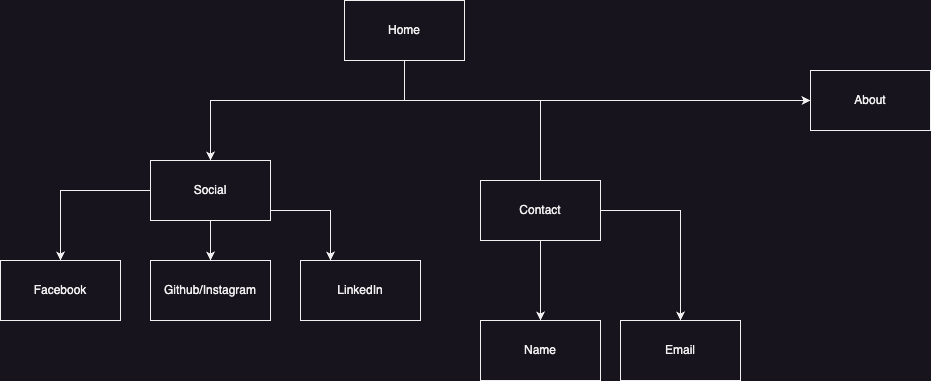

# Created Header for Portfolio Website

Have included all 4x Elements, including Home (Click on logo), About, Servies/Blog and Contact buttons.

## Created Main page of website

Have included Media, functioning buttons to take you to the Socials, About and Contact me page

### Link to Published website:

https://niklasfrost-portfolio.netlify.app/

#### Link to GitHub Repo:

https://github.com/nikthebest3/NiklasFrost__T1A2

##### Link to published video about website:

https://youtu.be/KbMS-mbB1bw - Unlisted video, Link will work if you copy and paste. Or Click on link if it works...

###### Description of Porfolio:

The purpose of the Website/Portfolio is to showcase my work that i can do,
It functions as it should, When you click on Laptop Logo it takes you to home page, Socials to Social Life page, About to About page, Contact to Contact page.

-->This is the image for the structure from Draw.io (sitemap)

<--

My target audience is: Web developers looking for someone to design a website....

HTML, CSS, Flexbox was all used in this website.
